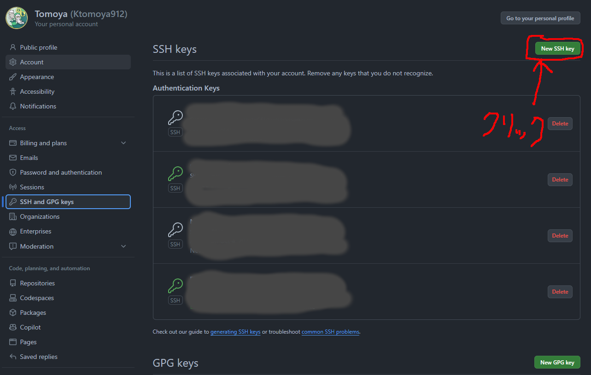

# REEL Project FastAPI
[](https://github.com/Ktomoya912/reel_back/actions/workflows/test_api.yml)


# 必要なソフトウェア
- [Docker Desktop](https://www.docker.com/products/docker-desktop)
- [WSL2(Windowsの場合)](https://docs.microsoft.com/ja-jp/windows/wsl/install-win10)
- [Git](https://git-scm.com/downloads)
- [Visual Studio Code](https://azure.microsoft.com/ja-jp/products/visual-studio-code/)

# 環境構築
## WSL2のインストール

```PowerShell
# 以下のコマンドでWSL2のインストールを行う
> wsl --install -d Ubuntu
# 以下のコマンドでUbuntuのバージョンを確認する
> wsl -l -v
```
ターミナル上でwslと入力するか、Ubuntuを直接起動するとUbuntuのターミナルが立ち上がる。Ubuntuのターミナルが起動すると初回起動時にユーザー名とパスワードの入力を求められるので入力する。  
以上でWSL2のインストールは完了する。

## Gitリポジトリのクローン
[このページ](https://github.com/Ktomoya912/reel_back)のCodeボタンを押してSSHのリンクをコピーする。
UbuntuもしくはMacのターミナル上で以下のコマンドを実行する。
```shell
$ git clone git@github.com:Ktomoya912/reel_back.git
```

<details><summary>失敗した場合</summary>
認証失敗のエラーが出た場合、SSHでクローンを行うようにする。
初めにSSHの鍵を作成する。

### SSHの鍵の作成

```shell
$ cd ~
$ mkdir .ssh
$ cd .ssh
$ ssh-keygen -t rsa
```

```shell
Enter file in which to save the key (/home/ユーザー名/.ssh/id_rsa): github
Enter passphrase (empty for no passphrase): そのままEnter
Enter same passphrase again: そのままEnter
```

以上で鍵の作成が終了する。
続いて作成した鍵をGitHubに登録する。
#### GitHubに公開鍵を登録
windowsのwsl2上で行っている場合は以下のコマンドを実行する。

```shell
$ cat github.pub | clip.exe
```

macの場合は以下のコマンドを実行する。

```shell
$ cat github.pub | pbcopy
```

以上でクリップボードに公開鍵がコピーされるので、GitHubの[SSH and GPG keys](
    https://github.com/settings/keys)にアクセスし、New SSH keyをクリックする。

titleは任意の名前を入力する。keyにはクリップボードにコピーした公開鍵を貼り付ける。
これでGitHubに公開鍵が登録される。

#### configファイルの作成
configファイルを作成することで、GitHubにSSHでアクセスする際に公開鍵を使用するようにする。

```shell
vi ~/.ssh/config
```
以下の内容を記述する。
```shell
Host github
  HostName github.com
  User git
  IdentityFile ~/.ssh/github
  Port 22
  # もし学内で優先接続を行う場合は以下の行を追加する
  ProxyCommand nc -X connect -x proxy.noc.kochi-tech.ac.jp:3128 %h %p
```

#### リポジトリのクローン

```shell
$ git clone github:Ktomoya912/reel_back.git
```

</details>

これでリポジトリがクローンされる。

続いてクローンしたリポジトリに移動し、Dockerイメージのビルドとコンテナの起動を行う。

```shell
$ cd reel_back
$ docker compose build
```

## 必要ライブラリのインストール
このコマンドを実行することで、pyproject.tomlに記述されている必要なライブラリがインストールされる。
```shell
$ docker compose run --entrypoint "poetry install --no-root" demo-app
$ docker compose up
```

上記コマンド実行後、以下のようなメッセージが表示され、シェルを一つ占有する。
```shell
reel_back-demo-app-1  | INFO:     Started server process [10]
reel_back-demo-app-1  | INFO:     Waiting for application startup.
reel_back-demo-app-1  | INFO:     Application startup complete.
```

以上のメッセージが表示されたら、APIの立ち上げは完了である。


<details><summary>学内の有線の場合</summary>
Proxyの関係でビルドが失敗する場合がある。その場合は~/.bashrcに以下の内容を追記し、ターミナルを再起動する。

```shell
export http_proxy=http://proxy.noc.kochi-tech.ac.jp:3128
export https_proxy=http://proxy.noc.kochi-tech.ac.jp:3128
```
これで再度試してほしい。
</details>

# APIのドキュメント
コンテナを起動した状態で`http://localhost:8000/docs`にアクセスするとAPIのドキュメントが表示される。
必要となるデータや、レスポンスの形式などが記述されている。

# APIのテスト
APIのテストは以下のコマンドを実行することで行うことができる。
```shell
$ docker compose run --entrypoint "poetry run pytest" demo-app
```

# APIの実行
APIの実行の一例を示す。詳しくはAPIのドキュメントを参照すること。

## ユーザーの作成
```shell
$ curl -X 'POST' \
  'http://localhost:8000/api/v1/users/' \
  -H 'accept: application/json' \
  -H 'Content-Type: application/json' \
  -d '{
  "password": "password",
  "username": "username",
  "image_url": "https://example.com",
  "email": "my@example.com",
  "sex": "o",
  "birthday": "2024-01-10",
  "user_type": "g"
}'
```
このコマンドの説明を行う。`curl`はコマンドラインからHTTPリクエストを送信するためのコマンドである。`-X`オプションはHTTPメソッドを指定する。メソッドは`GET`, `POST`, `PUT`, `DELETE`などがある。`-H`オプションはHTTPヘッダーを指定する。`-d`オプションはHTTPボディを指定する。`-d`オプションで指定するデータはJSON形式である。

# デプロイ
デプロイはAWSのEC2を使用して行う。
EC2上で、このリポジトリをクローンし、以下のコマンドを実行することでデプロイが行われる。
```shell
docker build -t reel-back:latest --platform linux/amd64 -f Dockerfile.cloud .
```
docker image が作成されたら、以下のコマンドを実行することでコンテナが立ち上がる。
```shell
docker run -d -p 8000:8000 --name reel-back reel-back:latest
```
ここでエラーが出る場合は、```.env```ファイルを作成していない、もしくは、必要になる環境変数が設定されていない可能性があるので、確認すること。

以上でデプロイは完了する。

# 各種エラーの対処法
## 起動時に`ModuleNotFoundError: No module named 'xxxx'`と出る
このエラーが出る原因は、Dockerイメージのビルド時に必要なパッケージがインストールされていないためである。
このエラーが出た場合は、以下のコマンドを実行する。
```shell
$ docker compose build --no-cache
```

## APIを叩いた際に`SQLAlchemyError: (sqlite3.OperationalError) no such table: xxx`と出る
このエラーが出る原因は、データベースのテーブルが作成されていないためである。そのためデータベースのマイグレーションを行う必要がある。
コンテナを実行した状態で以下のコマンドを実行する。
```shell
$ docker compose exec demo-app poetry run python -m api.migrate_db
```

## APIを叩いた際に`NoEnvironmentError: 環境変数が設定されていません。".env"ファイルに"{message}"を設定してください。`と出る
このエラーが出る原因は、`.env`ファイルに必要な環境変数が設定されていないためである。また、初回起動時に`.env`ファイルがDockerによって生成されるため権限によって保存できない場合がある。そのため、以下のコマンドを実行し、所有者を変更する。
```shell
$ sudo chown -R [username]:[username] ./
```
`[username]`には自分のユーザー名を入力する。

# 参考
- [FastAPI入門](https://zenn.dev/sh0nk/books/537bb028709ab9)  
    作業の最初の方はこのページを参照していたが、のちに大きく変更を加えたため、参考になる部分と参考にならない部分がある。
- [FastAPI公式ドキュメント](https://fastapi.tiangolo.com/ja/tutorial/)  
    公式のドキュメントであるため、情報量が多い。また、日本語に対応しているページも存在するため、よく読むことをお勧めする。
- [SQLAlchemyとFastAPIのリレーション](https://qiita.com/shimi7o/items/c009014b864c4412884a)  
    SQLAlchemyでのリレーションの書き方がわからない場合はここを参照すると良い。
